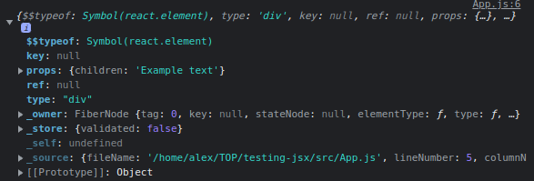
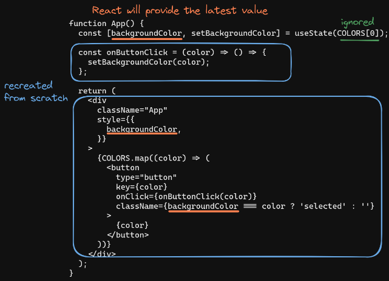
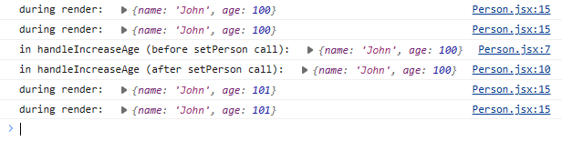
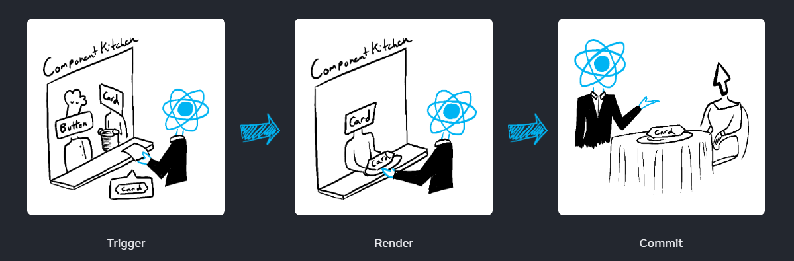
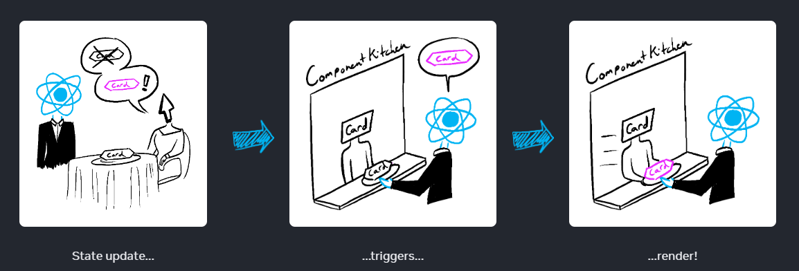
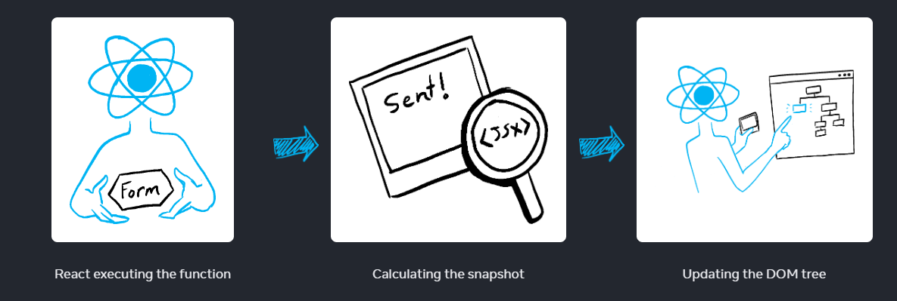
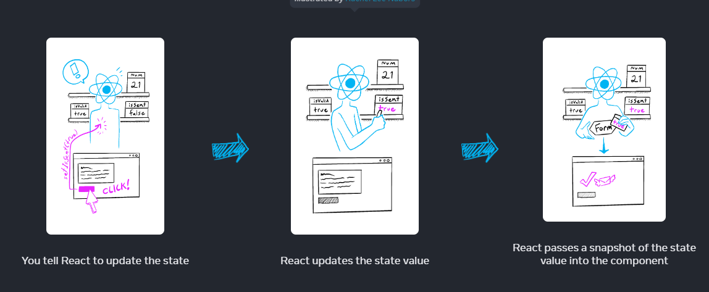
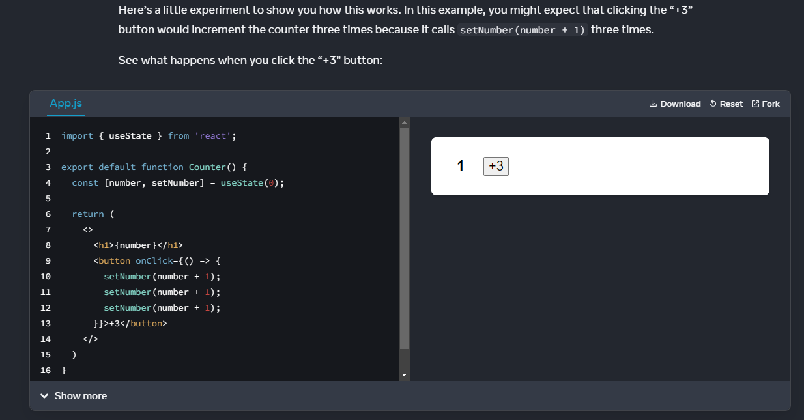
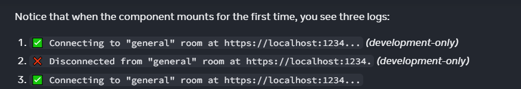

# React

# Introducción

React es un framework open-source de JavaScript creado por Facebook. Se utiliza para construir interfaces de usuario interactivas y aplicaciones web de manera rápida y eficiente a partir de componentes.

Una librería de JavaScript es una colección de código que es diseñado para hacer del desarrollo más rápido.

React provee de lo siguiente:

- Reusabilidad de componentes.
- Una gran comunidad que se encarga de dar mantenimiendo al framework.
- Es unopinionated, lo que significa que no liga a los desarrolladores a atenerse a ningún patrón de diseño específico, a una estructura organizacional de proyecto o lógica.

# Componentes

React permite abordar el diseño de la interfaz de usuario al descomponerla en **pedazos independientes reutilizables**, a los cuales se les refiere como componentes. La convención para el nombramieto de las funciones para crear componentes indica que se debe iniciar con letra mayúscula.

Se destaca que después de la versión de React v17.0 ya no es necesario importar React en los archivos JavaScript que lo utilizan:

```JavaScript
function Greeting() {
  return <h1>"I swear by my pretty floral bonnet, I will end you."</h1>;
}

export default Greeting;
```

# JSX

JSX es una extensión sintáctica de Javascript que permite escribir marcas similares a HTML (HTML-like markup) dentro de un archivo Javascript. No es obligatorio su uso, pero hace de la escritura de código más simple y concisa

En esencia, JSX es azúcar sintáctico (syntactic sugar) para la función **createElement**. Esta función crea un elemento React, que es un objeto plano, por lo que JSX compila a objetos JavaScript planos.

Por ejemplo, el valor de un elemento div JSX con texto se ve de la siguiente forma:



JSX le permite a React separar los concerns al contener tanto la lógica de renderizado y el contenido en el mismo lugar (un componente).

## Reglas de JSX

1. Retornar un solo elemento root.

   - Si se desean retornar múltiples elementos en el componente se puede envolver el contenido en un \<div> o usar React fragment si no se desea que el contenido tenga un contenedor.

   ```JavaScript
   function App() {
     return (
       <>
         <h1>Example h1</h1>
         <h2>Example h2</h2>
       </>
       // Could replace <></> with <div></div>
     );
   }
   ```

2. Cerrar todas las tags.

   - En HTML hay varias tags que son self-closing o self-wrapping. En JSX se deben cerar estas tags de forma explícita.
   - Es decir: \<input> sería \<input />, y \<li> sería \<li>\</li>

   ```JavaScript
   function App() {
      return (
        <>
          <input />
          <li></li>
        </>
      );
    }
   ```

3. Usar camelCase en la mayoría de las cosas.

   - JSX se se convierte en JavaScript, y los atibutos de elementos se convierte en llaves en objetos de JavaScript, por lo que no se pueden usar:
     - Guiones.
     - Palabras reservas como **class**.
   - Ejemplos:

     - En lugar de usar **stroke-width** se usaría **strokeWidth**.
     - En lugar de usar **class** se usaría **className**.

   ```JavaScript
   function App() {
     return (
       <>
         <div className="container">
           <svg>
             <circle cx="25" cy="75" r="20" stroke="green" strokeWidth="2" />
           </svg>
         </div>
       </>
     );
   }
   ```

## JavaScript en JSX con llaves (Curly Braces {})

Cualquier expresión JavaScript va a funcionar dentro de Curly Braces, incluyendo funciones.

Se pueden usar de dos maneras dentro de JSX:

1. Como texto directamente dentro de una tag JSX.

   ```html
   <h1>{name}'s To Do List</h1>
   ```

- No se debe usar como tags:

  ```html
  <{tag}>Gregorio Y. Zara's To Do List</{tag}>
  ```

2. Como atributos inmediatamente después del símbolo igual (=).

   ```JavaScript
   src={avatar}
   ```

### CSS y otros objetos en JSX usando llaves dobles (double curlies)

Se pueden pasar objetos en JSX, los cuales se deben envolver en llaves.

```JavaScript
person={{ name: "Hedy Lamarr", inventions: 5 }}
```

Se puede usar inline style usando también llaves dobles, lo cual permite pasar un objeto al atributo de **style**.

```JavaScript
export default function TodoList() {
  return (
    <ul style={{
      backgroundColor: 'black',
      color: 'pink'
    }}>
      <li>Improve the videophone</li>
      <li>Prepare aeronautics lectures</li>
      <li>Work on the alcohol-fuelled engine</li>
    </ul>
  );
}
```

<div style='background:radial-gradient(circle at 10% 20%, rgb(255, 200, 124) 0%, rgb(252, 251, 121) 90%); color:black; font-weight:bold; padding:10px 10px; padding-top:3px; border-radius:10px;'>
<h1>Pitfall</h1>

Las propiedades **style** se escriben en camelCase. Por ejemplo:

- \<ul style="background-color: black"> se escribría como \<ul style={{ backgroundColor: 'black' }}>
</div>

# Renderizado condicional

Por medio de expresiones condicionales se decide qué renderizar en la interfaz de usuario de acuerdo con el estado de determinadas variables.

## Operador ternario

Se utiliza en conjunto con valores booleanos.

```JavaScript
function List(props) {
  return (
    <ul>
      {props.animals.map((animal) => {
        return animal.startsWith("L") ? <li key={animal}>{animal}</li> : null;
      })}
    </ul>
  );
}
```

En este ejemplo se usa el método de String llamado **startsWidth** para determinar qué animales de la lista se van a tomar.

## Operador &&

```JavaScript
function List(props) {
  return (
    <ul>
      {props.animals.map((animal) => {
        return animal.startsWith("L") && <li key={animal}>{animal}</li>;
      })}
    </ul>
  );
}
```

En este caso si el resultado de la función **startsWidth** es verdadero entonces se retorna el segundo operando, el cual es el elemento \<li>. En caso contrario, si la condición es **false** se ignora.

<div style='background:radial-gradient(circle at 10% 20%, rgb(255, 200, 124) 0%, rgb(252, 251, 121) 90%); color:black; font-weight:bold; padding:10px 10px; padding-top:3px; border-radius:10px;'>
<h1>Falsy values en JSX</h1>

Los valores siguientes no renderizan nada:

- null
- undefined
- false

Pero los valores siguentes son válidos en JSX, por lo que se renderizan completamente bien:

- 0
- '' (String vacío)
</div>

## Otras maneras de renderizar condicionalmente

Es posible utilizar:

- if
- if/else
- switch

```JavaScript
function List(props) {
  if (!props.animals) {
    return <div>Loading...</div>;
  }

  if (props.animals.length === 0) {
    return <div>There are no animals in the list!</div>;
  }

  return (
    <ul>
      {props.animals.map((animal) => {
        return <li key={animal}>{animal}</li>;
      })}
    </ul>
  );
}
```

En este ejemplo se tienen dos sentencias actuando como guardia que inmediatamente retorna un elemento según la condición. Un IF se encarga de ver que la propiedad de **animals** exista, y el otro checa que la longitud de la lista sea ayor que 0.

# Keys en React

Permiten identificar de forma única un elemento entre sus hermanos. Una clave bien elegida proporciona más información que la posición dentro del array. Incluso si la posición cambia debido a la reordenación, la clave permite a React identificar el elemento a lo largo de su vida.

Las keys permiten reastrear elementos especifico que pueden llegar a cambiar y asegurarse que solo se rendericen esos y no el conjunto entero. En otras palabras, las claves indican a React a qué elemento del array corresponde cada componente, para que pueda emparejarlos más tarde.

Cuando una lista se actualiza React se encarga de hacer coincidir las llaves de cada elemento de la lista anterior con las keys de los elementos en la lista actualizada.

Las keys se pasan al componente o al elemento DOM como una prop.

```JavaScript
<Component key={keyValue} />
//or
<div key={keyValue} />
```

Al usar Keys se tiene como recomendación no crearlas sobre la marcha, por ejemplo, usando:

- key={Math.random()}
- key={uuid()}

Se recomienda utilizar librerías como uuid para brindar un ID único a cada elemento. En otras palabras, las llaves deben inferirse de la data misma:

```JavaScript
const todos = [
  { task: "mow the yard", id: uuid() },
  { task: "Work on Odin Projects", id: uuid() },
  { task: "feed the cat", id: uuid() },
];

function TodoList() {
  return (
      <ul>
        {todos.map((todo) => (
          // DON'T do the following i.e. generating keys during render
          <li key={uuid()}>{todo.task}</li>
        ))}
      </ul>
  )
}
```

## Reglas de Keys

- Deben ser únicas entre siblings. Sin embargo, se pueden usar las mismas Keys para nodos JXS en diferentes arreglos.
- Las Keys no deben cambiar, por lo que no se deben generar durante el proceso de renderizado.

# Props, método para pasar datos entre componentes

Es la forma corta para referirse a **properties**.

La data en React se transmite desde el padre hasta los componentes hijos por medio de props. La transferencia es **unidireccional**, es decir, el flujo va en un solo sentido.

El uso de props permiten personalizar el comoprtamiento de los componentes.

## Destructuración de props.

Si no se destructuran las props en el componentes entonces se acceden a ellas por medio de la palabra reservada props.

```JavaScript
function Button(props) {

  const buttonStyle = {
    color: props.color,
    fontSize: props.fontSize + 'px'
  };

  return (
    <button style={buttonStyle}>{props.text}</button>
  )
}

export default function App() {
  return (
    <div>
      <Button text="Click Me!" color="blue" fontSize={12} />
      <Button text="Don't Click Me!" color="red" fontSize={12} />
      <Button text="Click Me!" color="blue" fontSize={20} />
    </div>
  );
}
```

Sin embargo, es posible extraerlas por medio de la sintaxis de destructuración.

```JavaScript
function Button({ text, color, fontSize }) {
  const buttonStyle = {
    color: color,
    fontSize: fontSize + "px"
  };

  return <button style={buttonStyle}>{text}</button>;
}

export default function App() {
  return (
    <div>
      <Button text="Click Me!" color="blue" fontSize={12} />
      <Button text="Don't Click Me!" color="red" fontSize={12} />
      <Button text="Click Me!" color="blue" fontSize={20} />
    </div>
  );
}
```

## Default props

Contribuyen a no tener que repetir en la definición de las props, ya que se observa que se redefinen valores comunes en el ejemplo anterior. Además, las default props ayudan a defender el la aplicación de valores indefinidos.

```JavaScript
function Button({ text, color, fontSize }) {
  const buttonStyle = {
    color: color,
    fontSize: fontSize + "px"
  };

  return <button style={buttonStyle}>{text}</button>;
}

Button.defaultProps = {
  text: "Click Me!",
  color: "blue",
  fontSize: 12
};

export default function App() {
  return (
    <div>
      <Button />
      <Button text="Don't Click Me!" color="red" />
      <Button fontSize={20} />
    </div>
  );
}
```

De esta forma, solo se necesita proveer los valores de las props al componente de Button al renderizarlo dentro de App si difieren de los valores por defecto definidos en Button.defaultProps.

Otro método para conseguir esto es al momento de definir las props.

```JavaScript
function Button({ text = "Click Me!", color = "blue", fontSize = 12 }) {
  const buttonStyle = {
    color: color,
    fontSize: fontSize + "px"
  };

  return <button style={buttonStyle}>{text}</button>;
}
```

## Funciones como Props

```JavaScript
function Button({ text = "Click Me!", color = "blue", fontSize = 12, handleClick }) {
  const buttonStyle = {
    color: color,
    fontSize: fontSize + "px"
  };

  return (
    <button onClick={handleClick} style={buttonStyle}>
      {text}
    </button>
  );
}

export default function App() {
  const handleButtonClick = () => {
    window.location.href = "http://www.google.com";
  };

  return (
    <div>
      <Button handleClick={handleButtonClick} />
    </div>
  );
}
```

En este ejemplo se pasa una prop llamada **handleClick**, la cual recibirá una función llamada handleButtonClick definida en el padre. La prop **handleClick** es una referencia a la función que se pasa.

**Notas**:

- Solo se pasa una referencia de **handleButtonClick**, por lo que no se incluyen los paréntesis al pasar la función al componente Button. Si se hicier algo como: **handleClick={handleButtonClick()}** entonces la función sería llamada cuando el botón se renderiza.
- Se puede renombrar la función con cualquier nombre cuando se pasa como Prop, ya que el nombre de la prop y el valor no necesitan ser el mismo.
- Cada botón que llame a esta función va a navegar a la misma página. Se puede refactorizar a la función y proveer un parámetro dentro del bo´tom para personalizar su funcionalidad.

```JavaScript
function Button({ text = "Click Me!", color = "blue", fontSize = 12, handleClick }) {
  const buttonStyle = {
    color: color,
    fontSize: fontSize + "px"
  };

  return (
    <button onClick={() => handleClick('https://www.theodinproject.com')} style={buttonStyle}>
      {text}
    </button>
  );
}

export default function App() {
  const handleButtonClick = (url) => {
    window.location.href = url;
  };

  return (
    <div>
      <Button handleClick={handleButtonClick} />
    </div>
  );
}
```

- Al proveer un parámetro a la función no solo se puede escribir: onClick={handleClick('www.theodinproject.com')}, sino que se debe ligar una referencia a una función anónima que luego llame a la función con el parámetro. Eso se hace para prevenir que la función se invoque durante el renderizado.

## Pasar JSX como children

Así como se envuelven tags en HTML es posible hacerlo con los componentes. En HTML se realiza de la siguiente manera:

```HTML
<div>
 
</div>
```

En React se sigue la misma estructura con los componentes.

```JavaScript
<Card>
  <Avatar />
</Card>
```

Al anidar el contenido en una tag JSX, el componente padre recibe ese contenido en una prop llamada **children**. Por ejemplo, el componente \<Card> recibe la prop **children**, la cual contiene a \<Avatar /> y lo renderiza en un div.

```JavaScript
import Avatar from './Avatar.js';

function Card({ children }) {
  return (
    <div className="card">
      {children}
    </div>
  );
}

export default function Profile() {
  return (
    <Card>
      <Avatar
        size={100}
        person={{
          name: 'Katsuko Saruhashi',
          imageId: 'YfeOqp2'
        }}
      />
    </Card>
  );
}
```

Si se reemplazara el comopnente Avatar en Card por texto, el componente Card puede envolver cualquier contenido anidado, lo que indica que no necesita saber qué se renderiza dentro de sí.

Se puede pensar de un componente con la prop de children como tener un agujero que puede rellenarse por sus componentes padres con JSX arbitrario. Usualmente se usa la prop de children para envolvente visuales: panels, grids, etc.


## Cambio de las props con el paso del tiempo

Un componente puede recibir diferentes props conforme pasa el tiempo, por o que las props no son siempre estáticas. Las Props reflejan la data de un componente en cualquier punto del tiempo en vez de solo al principio.

Las props son inmutables. Cuando un componente debe cambiar sus props (ya sea como respuesta a la interacción del usuario o nueva data), el componente padre deberá pasar props diferentes. Entonces, las props antiguas se descartan, y el engine de JavaScript reclamará la memoria que se ocupaba por esas props.

# STATE

Se puede ver el estado como el snapshot actual del programa o parte de él, es decir, es data que controla qué está haciendo el programa.

Por otro lado, en React el estado es la capacidad de un componente de recordad (State es la memoria del componente). En otras palabras, el estado brinda a un componente de persistir la data.

El State es asilado y privado a diferencia de las props. Es local para la instancia de un componente. Entonces, si se renderiza el mimo componente dos veces, cada copia tendrá un estado asilado, por lo que cambiar alguno de ellos no afectará al otro.

## UseState Hook

Permite definir el estado en un componente funcional. Toma un valor inicial como parámetro y retorna dos elementos.

- El valor actual del estado.
- Una función para actualizar el valor del estado.

```JavaScript
const [stateValue, setStateValue] = useState(initialValue);
```

## Funcionamiento de State en React

En React cuando un estado del comopnente o prop cambia, el componente es destruido y recreado desde 0. Sin embargo, esta vez el últio valor del estado se retorna de useState. A este proceso se le llama **rerendering**.

El término **rerendering** permite a React actualizar de manera eficiente la interfaz de usuario en respuesta a cambios en los datos subyacentes.

<div style='background:radial-gradient(circle at 10% 20%, rgb(255, 200, 124) 0%, rgb(252, 251, 121) 90%); color:black; font-weight:bold; padding:10px 10px; padding-top:3px; border-radius:10px;'>
<h1>React reconciliation algorithm</h1>

El proceso de rerendering crea un nuevo árbol DOM virtual (Document Object Model). El DOM virtual es una representación ligera (lightweight) del DOM actual que React usa para llevar registro (keep track) del estado actual de la UI. Luego, React compara el nuevo árbol DOM virtual con el anterior y calcula el conjunto mínimo de cambios necesarios apra actualizar el DOM actual.

</div>

Reconciliación es el proceso por el cual React actualiza el UI para reflejar los cambios en el estado del componente. El conjunto de algoritmo es un conjunto de reglas que React usa para determinar cómo actualizar la UI de la forma más eficiente.

React usa un DO virtual para actualizar el UI, el cual es una representación en memoria ligera del DOM real, lo que le permite a React hacer cambios a la UI sin manipular el DOM actual. Esto hacer que las actualizaciones sean rápidas, ya que cambiar el DOM virtual es menos costoso que cambiar el DOM real.

El algoritmo de reconciliación compara el árbol de DOM virtual actal con el árbol de DOM virtual actualizado, y realizando el mínimo número de cambios necesarios para que el DOM virtual se ajuste al estado actualizado.

El algoritmo usa dos técnicas principales para optimizar las actualizaciones:

- Tree diffing: React compara el árbol DOM virtual actual con el árbol DOM virtual actualizado, e identifica el número mínimo de cambios necesarios para que el DOM virtual se ajuste al estado actualizado.
- Batching: React agrupa múltiples cambios en una sola actualización, reduciendo el número de actualizaciones del DOM virtual y, a su vez, del DOM real.

Una vez que el reconciliador compara el DOM virtual actual y el actualizado, identifica las diferencias y realiza los cambios necesarios en el DOM virtual para adecuarlo al estado actualizado.

Esta actualización del DOM virtual se realiza por varias razones:

1. Mantener el DOM virtual como una representación exacta del estado actual de los componentes, para que pueda ser utilizado en futuras actualizaciones.

2. Optimizar las actualizaciones del DOM real. El DOM virtual permite a React realizar cambios en la interfaz de usuario sin manipular directamente el DOM real. Al realizar cambios en el DOM virtual, React puede determinar la forma más eficiente de actualizar el DOM real y realizar sólo el mínimo número de cambios necesarios.

3. Asegurar que la UI permanece sincronizada con el estado de los componentes. El proceso de reconciliación asegura que el DOM virtual refleja con precisión el estado actual de los componentes para que la IU permanezca actualizada y en línea con el estado de la aplicación.

En resumen, el reconciliador actualiza el DOM virtual tras el proceso de reconciliación para mantenerlo preciso, optimizar las actualizaciones del DOM real y garantizar que la IU se mantiene sincronizada con el estado de los componentes.

### Ejemplificación de Rerendering

Con un estado llamado backgroundColor, cada que se llama a su función setter, el componente App se vuelve a renderizar. En esencia, el compoente se recrea al igual que la función onButtonClick, el div y el botón. Entonces, el estado backgroundColor se recrea igualmente pero React se encarga de llevar registro el último valor del estado y de proveerlo al componente.

El valor inicial de un estado solo se utiliza para la primera renderización del componente, y se igora en los renderizados subsecuentes.



## Razones del uso de State

1. No se pueden usar variables locales para ejecutar el trabajo del estado, ya que las variables locales no se persisten entre renderizados.
2. Los cambios en variables locales no disparan una renderización.

Para actualizar un coponente con nuevos datos se deben cumplir las siguientes dos condiciones:

1. Una variable estado que retenga los datos entre renderizados.
2. Una función setter para actualizar la variagle y disparar el renderizado del componente.

## Consejos

Es adecuado tener varios estados si sus valores no se relacionan. Sin embargo, si se halla que se cambian dos variables de estado juntas, puede ser más fácil combinarlos en uno solo. Por ejemplo, en un formulario con varios campos, es más coveniente tener una sola variable de estado en contenga un objeto que una variable por campo.

# Hooks

Se deben cumplir las siguientes reglas:

1. Los Hooks solo se pueden llamar desde el nivel superior (top level) de un componente funcional.
2. Los Hooks no se pueden llamar desde condiciones, ciclos y funciones anidadas.
3. Empiezan con el prefijo **use**

Los Hooks son funciones, pero es útil pensarlos como declaraciones incondicionales acerca de las necesidades del componente.

## Cómo React sabe qué estado retornar

En cambio, para permitir su sintaxis concisa, los Hooks se basan en un orden de llamada estable en cada renderización del mismo componente. Esto funciona bien en la práctica porque si sigues la regla anterior ("sólo llamar a los Hooks en el nivel superior"), los Hooks siempre serán llamados en el mismo orden. Internamente, React mantiene un array de pares de estados para cada componente. También mantiene el índice del par actual, que se establece en 0 antes de la renderización. Cada vez que llamas a useState, React te da el siguiente par de estados e incrementa el índice.

Cada que se llama useState, React brinda el siguiente par de estados e incrementa el índice-.

## El estado es inmutable

Para casos en donde el estado sea un arreglo o un objeto, se debe crear una copia del origina y modificar lo necesario.

```JavaScript
function Person() {
   const [person, setPerson] = useState({ name: 'John', age: 100 });

   // BAD - Don't do this!
   const handleIncreaseAge = () =>{
      // mutating the current state object
      person.age = person.age + 1;
      setPerson(person);
   }

   // GOOD - Do this!
   const handleIncreaseAge = () =>{
      // copy the existing person object into a new object
      // while updating the age property
      const newPerson = { ...person, age: person.age + 1 };
      setPerson(newPerson);
   }

   return (
      <>
         <h1>{person.name}</h1>
         <h2>{person.age}</h2>
         <button onClick={handleIncreaseAge}>Increase age</button>
      </>
   )
}
```

## Actualizar estados

Las acualizaciones de los estados son asíncronas. Entonces, cada que se llama a la función **setState**, React aplicará la actualizaión en el siguiente renderizado del componente.

<div style='background-color: #045de9; background-image: linear-gradient(315deg, #045de9 0%, #09c6f9 74%); color:white; font-weight:bold; padding:10px 10px; padding-top:3px; border-radius:10px;'>
<h1>Las variables de estado no son reactivos</h1>

Las variables de estado no son reactivos, pero sí el componente. Esto puede ser entendido con el hecho de que al llamar **setState** se renderiza el componente completo en lugar de solo cambiar la variable de estado sobre la marcha.

</div>

```JavaScript
function Person() {
   const [person, setPerson] = useState({ name: 'John', age: 100 });

   const handleIncreaseAge = () =>{
      console.log("in handleIncreaseAge (before setPerson call): ", person)
      setPerson({ ...person, age: person.age + 1 });
      // we've called setPerson, surely person has updated?
      console.log("in handleIncreaseAge (after setPerson call): ", person);
   }

   // this console.log runs every time the component renders
   // what do you think this will print?
   console.log("during render: ", person);

   return (
      <>
         <h1>{person.name}</h1>
         <h2>{person.age}</h2>
         <button onClick={handleIncreaseAge}>Increase age</button>
      </>
   )
}
```

Los logs de lo anterior son:



Lo que sucede es:

1. El componente se renderiza por primera vez. La variable de estado **person** se inicializa. El console log que ocure durante el renderizado imprime la variable de estado.
2. Al invocar **handleIncreaseAge**, se aprecia que los console logs dentro de la función muestran el mismo resultado al imprimir el valor de la variable de estado.
3. El componente se vuelve a renderizar, y la variable de estado ya aparece actualizada.

Entonces, se aprecia que el estado **person** permanece igual a lo largo del renderizado actual del componente. Esto es a lo que se refiere "state as a snapshot".

## Funciones de actualización de estado

Se tiene el siguiente código:

```JavaScript
const handleIncreaseAge = () => {
   setPerson({ ...person, age: person.age + 1 });
   setPerson({ ...person, age: person.age + 1 });
}
```

Esté código indica:

    Hey, replace the current render’s person with an increase in age by 1. Then, replace the current render’s person with an increase in age by 1.

Si se desea actualziar el estado varias veces usando el último estado, entonces aquí es donde entra en juego la función de actualización del estado.

```JavaScript
const handleIncreaseAge = () => {
   setPerson((prevPerson) => ({ ...prevPerson, age: prevPerson.age + 1 }));
   setPerson((prevPerson) => ({ ...prevPerson, age: prevPerson.age + 1 }));
}
```

Cuando una CALLBACK se pasa a la función de **setState**, se asegura que el último estado se pase como una argumento.

<div style='background-color: #045de9; background-image: linear-gradient(315deg, #045de9 0%, #09c6f9 74%); color:white; font-weight:bold; padding:10px 10px; padding-top:3px; border-radius:10px;'>
<h1>React agrupa (batches) las actualizaciones de estado</h1>

Hay dos llamadas a setPerson en el ejemplo anterior, y por lo que hemos aprendido hasta ahora, una llamada a setState desencadena un re-render del componente. Así que el componente debería renderizarse dos veces, ¿no? Podríamos decir que sí, pero React es inteligente. Siempre que es posible, React agrupa las actualizaciones de estado. Aquí el componente sólo se vuelve a renderizar una vez.

</div>

## Controlled components

Hay elementos HTML native que mantiene su propio estado interno, tal como el elemento INPUT. Para poder controlar el valor de este elemento, entonces se usan componentes controlados.

```JavaScript
function CustomInput() {
   const [value, setValue] = useState('');

   return (
      <input
         type="text"
         value={value}
         onChange={(event) => setValue(event.target.value)}
      />
   );
}
```

De esta forma, se establece la prop VALUE con la variable de esado y se actualiza la variable de esado con el evento **onChange**. De esta forma, React se encarga de que el último valor esté en VALUE.

## Choosing State Structure

https://react.dev/learn/choosing-the-state-structure

Los principios para el estructurado de estado son:

1. Agrupar estados relacionados. Si siempre actualiza dos o más variables de estado al mismo tiempo, considere la posibilidad de fusionarlas en una única variable de estado.
2. Evitar contradicciones en el estado. Cuando el estado está estructurado de tal forma que varias piezas de estado pueden contradecirse y "discrepar" entre sí, dejas espacio para los errores. Intente evitarlo.
3. Evita el estado redundante. Si puedes calcular alguna información a partir de los props del componente o de sus variables de estado existentes durante el renderizado, no deberías poner esa información en el estado de ese componente.
4. Evite la duplicación en el estado. Cuando los mismos datos se duplican entre múltiples variables de estado, o dentro de objetos anidados, es difícil mantenerlos sincronizados. Reduzca la duplicación siempre que pueda.
5. Evite el anidamiento profundo del estado. El estado jerárquico profundo no es muy cómodo de actualizar. Cuando sea posible, prefiera estructurar el estado de forma plana.

### Agrupar estados relacionados

Se tiene el siguiente código:

```JavaScript
const [x, setX] = useState(0);
const [y, setY] = useState(0);
```

Se puede organizar de la siguiente manera:

```JavaScript
const [position, setPosition] = useState({ x: 0, y: 0 });
```

De esta manera se tiene en un solo lugar varaibles que siempre cambian juntas. Entonces, el código final sería:

```JavaScript
import { useState } from 'react';

export default function MovingDot() {
  const [position, setPosition] = useState({
    x: 0,
    y: 0
  });
  return (
    <div
      onPointerMove={e => {
        setPosition({
          x: e.clientX,
          y: e.clientY
        });
      }}
      style={{
        position: 'relative',
        width: '100vw',
        height: '100vh',
      }}>
      <div style={{
        position: 'absolute',
        backgroundColor: 'red',
        borderRadius: '50%',
        transform: `translate(${position.x}px, ${position.y}px)`,
        left: -10,
        top: -10,
        width: 20,
        height: 20,
      }} />
    </div>
  )
}
```

Otro buen caso de dónde agrupar datos en un objeto o en un arreglo es cuando no se sabe cuátnas piezas de estado se van a necesitar. Por ejemplo, puede ser de ayuda cuando se tiene un formulario en donde el usuario tiene que agregar campos personalizados.

<div style='background-color: #045de9; background-image: linear-gradient(315deg, #045de9 0%, #09c6f9 74%); color:white; font-weight:bold; padding:10px 10px; padding-top:3px; border-radius:10px;'>
<h1>Pitfall</h1>

Si tu variable de estado es un objeto, recuerda que no puedes actualizar sólo un campo en él sin copiar explícitamente los otros campos. Por ejemplo, no puedes hacer setPosition({ x: 100 }) en el ejemplo anterior porque no tendría la propiedad y en absoluto. En su lugar, si quisieras establecer sólo x, tendrías que hacer setPosition({ ...position, x: 100 }), o dividirlas en dos variables de estado y hacer setX(100).

</div>

### Evitar contradicciones en el estado

Por ejemplo, se tiene un formulario de retroalimentación con las variables de estado: **isSending** **isSent**.

```JavaScript
import { useState } from 'react';

export default function FeedbackForm() {
  const [text, setText] = useState('');
  const [isSending, setIsSending] = useState(false);
  const [isSent, setIsSent] = useState(false);

  async function handleSubmit(e) {
    e.preventDefault();
    setIsSending(true);
    await sendMessage(text);
    setIsSending(false);
    setIsSent(true);
  }

  if (isSent) {
    return <h1>Thanks for feedback!</h1>
  }

  return (
    <form onSubmit={handleSubmit}>
      <p>How was your stay at The Prancing Pony?</p>
      <textarea
        disabled={isSending}
        value={text}
        onChange={e => setText(e.target.value)}
      />
      <br />
      <button
        disabled={isSending}
        type="submit"
      >
        Send
      </button>
      {isSending && <p>Sending...</p>}
    </form>
  );
}

// Pretend to send a message.
```

Si por alguna razón se olvida llamar setIsSent juntos, entonces ambos estados van a estar en verdadero. Entre más complejo sea el componente, más difícil es saber qué pasó. Entoncesm es meor reemplazar estos estados con uno solo que pueda tomar uno de tres estados validos:

- typing (initial)
- sending
- sent

```JavaScript
import { useState } from 'react';

export default function FeedbackForm() {
  const [text, setText] = useState('');
  const [status, setStatus] = useState('typing');

  async function handleSubmit(e) {
    e.preventDefault();
    setStatus('sending');
    await sendMessage(text);
    setStatus('sent');
  }

  const isSending = status === 'sending';
  const isSent = status === 'sent';

  if (isSent) {
    return <h1>Thanks for feedback!</h1>
  }

  return (
    <form onSubmit={handleSubmit}>
      <p>How was your stay at The Prancing Pony?</p>
      <textarea
        disabled={isSending}
        value={text}
        onChange={e => setText(e.target.value)}
      />
      <br />
      <button
        disabled={isSending}
        type="submit"
      >
        Send
      </button>
      {isSending && <p>Sending...</p>}
    </form>
  );
}

// Pretend to send a message.
function sendMessage(text) {
  return new Promise(resolve => {
    setTimeout(resolve, 2000);
  });
}
```

De igual manera, se pueden declarar constantes para legibilidad. Estas variables no son estados, por lo que no hay que preocuparse que se salgan de sincronización.

```JavaScript
const isSending = status === 'sending';
const isSent = status === 'sent';
```

### Evitar estado redundante

Al tener los siguientes estados, es posible deshacerse del estado **fullName**, ya que puede ser calculado de los dos anteriores.

```JavaScript
  const [firstName, setFirstName] = useState('');
  const [lastName, setLastName] = useState('');
  const [fullName, setFullName] = useState('');
```

Entonces, el estado fullName puede calcularse como:

```JavaScript
  const [firstName, setFirstName] = useState('');
  const [lastName, setLastName] = useState('');

  const fullName = firstName + ' ' + lastName;
```

<div style='background:radial-gradient(circle at 10% 20%, rgb(255, 200, 124) 0%, rgb(252, 251, 121) 90%); color:black; font-weight:bold; padding:10px 10px; padding-top:3px; border-radius:10px;'>
<h1>Don't mirror props in state</h1>

```JavaScript
function Message({ messageColor }) {
  const [color, setColor] = useState(messageColor);
```

Lo anterior es un ejemplo de estado redundante. Al colocar a la prop en un estado da el problema de que si el padre pasa una prop diferente después, la variable de estado **color** no se va a actualizar. El estado solo se inicializa durante el primer renderizado. En su lugar, se puede usar la prop directamente en el código o renombrarla usando una constante.

```JavaScript
function Message({ messageColor }) {
  const color = messageColor;
```

Colocar props en estado es úti cuando se quiere ignorar todas las actualizaciones de una PROP. Por convención, se inicia el nombre de la prop con las palabras **initial** o **default**para clarificar que sus nuevos valores son ignorados.

```JavaScript
function Message({ initialColor }) {
  // The `color` state variable holds the *first* value of `initialColor`.
  // Further changes to the `initialColor` prop are ignored.
  const [color, setColor] = useState(initialColor);
```

</div>

### Evitar duplicación en el estado

```JavaScript
const initialItems = [
  { title: 'pretzels', id: 0 },
  { title: 'crispy seaweed', id: 1 },
  { title: 'granola bar', id: 2 },
];

export default function Menu() {
  const [items, setItems] = useState(initialItems);
  const [selectedItem, setSelectedItem] = useState(
    items[0]
  );
```

En este ejemplo se almacena el item como un objeto en la variable de estado **selectedItem**, el cual es el mismo objeto que está dentro de la lista **items**. Esto significa que la información acerca del objeto mismo está duplicada en dos lados. Esto puede ser un problema, ya que ahora se deben actualizar ambos estados para reflejar la información de forma correcta. Una forma de arreglar esto es mejor almacenar el índice del item actual a mostrar en lugar de tener guardado el item actual.

```JavaScript
  const [items, setItems] = useState(initialItems);
  const [selectedId, setSelectedId] = useState(0);
```

### Evitar anidamiento profundo

```JavaScript
export const initialTravelPlan = {
  id: 0,
  title: '(Root)',
  childPlaces: [{
    id: 1,
    title: 'Earth',
    childPlaces: [{
      id: 2,
      title: 'Africa',
      childPlaces: [{
        id: 3,
        title: 'Botswana',
        childPlaces: []
      }, {
        id: 4,
```

Este objeto es difícil de actualizar, ya que implica hacer varias copias de los objetos. Entonces, se recomienda usar una versión **plana** (normalizada).

```JavaScript
export const initialTravelPlan = {
  0: {
    id: 0,
    title: '(Root)',
    childIds: [1, 42, 46],
  },
  1: {
    id: 1,
    title: 'Earth',
    childIds: [2, 10, 19, 26, 34]
  },
  2: {
    id: 2,
    title: 'Africa',
    childIds: [3, 4, 5, 6 , 7, 8, 9]
  },
```

## Render y Commit

Visto desde una perspectiva de un restuarante, React es el mesero que se encarga de llevar las peticiones del cliente al Chef. El proceso de solicutar y servir la UI tiene tres pasos:

1. Triggering un renderizado (entregar la petición del usuario a la cocina).
2. Renderizado del componente (preparar la orden en la cocina).
3. Committing al DOM (entregar la orden al cliente).

)

### Paso 1. Trigger un render

Hay dos razones para que un componente se renderice:

1. Es el renderizado inicial del componente.
2. El estado del componente o de uno de sus ancestros se ha actualizado.

#### Renderizado inicial

Cuando la aplicación inicial, se debe disparar el renderizado inicial. Los Frameworks y sandbxes ensconden el código, pero usualmente se hace al llamar **createRoot** con el nodo del DOM target, y luego se llama a su método **render** con el componente.

```JavaScript
import Image from './Image.js';
import { createRoot } from 'react-dom/client';

const root = createRoot(document.getElementById('root'))
root.render(<Image />);
```

#### Re-renders con las actualizaciones de estado

Actualizar el estado del componente automaticamente queues (pone en cola) un renderizado. (Se puede ver como el cliente de un restaurante que pide té, postre y todo tipo de cosas después de hacer su primer pedido, dependiendo del estado de su sed o hambre).



### Paso 2. React renderiza el componente

Después de disparar el renderizado, React llama al componente para averiguar qué mostrar en pantalla. **Rendering** es React llamando a los componentes, los cuales son funciones. El JSX que se retorna de esa función es como un snapshot de la UI en el tiempo (sus props, event handlers y variables locales fueron calculadas usando su estado al momento del renderizado).

A diferencia de una foto o frame de una película, el "snapshot" de la UI es interactivo. Incluye lógica como event handlers que especifica qué sucede en respuesta a las entradas. React actualiza la pantalla para hacer concidir esta snapshot y conecta los event handlers. Entonces, presionar un botón va a disparar al click handler del JSX.

- En el renderizado inicial, React llama al componente ROOT.
- Para renderizados subsecuentes, React llama al componente función cuyo actualización de estado disparó el renderizado.

Este proceso es recursivo: si el componente actualizado retorna alún otro componente, React va a renderizar a ese componente después, en donde el proces se repite si ese componente retorna otros componentes. El proceso finaliza hasta que no haya más componentes anidados y React sepa exactamente mostrar en pantalla.

En el siguiente ejemplo React llamará a Gallery() e Image() varias veces:

```JavaScript
export default function Gallery() {
  return (
    <section>
      <h1>Inspiring Sculptures</h1>
      <Image />
      <Image />
      <Image />
    </section>
  );
}

function Image() {
  return (
    
  );
}
```

- Durante el renderizado inicial React creará los nodos de DOM para SECTION, H1 y las tres imágenes.
- Surante los re-render, React calcula cuáles de sus propiedades, si las hay, han cambiado desde el renderizado anterior. No va a hacer nada hasta la siguiente fase: la fase commit.

<div style='background:radial-gradient(circle at 10% 20%, rgb(255, 200, 124) 0%, rgb(252, 251, 121) 90%); color:black; font-weight:bold; padding:10px 10px; padding-top:3px; border-radius:10px;'>
<h1>Renderizado debe ser un cálculo puro</h1>

- Mismas entradas, misma salida. Dadas las mismas entradas, un componente debe retornar siempre el mismo JSX. (Cuando alguien ordena una ensalada con tomates, no deben recibir una ensalada con cebolla).
- Se ocupa solo de su tarea. No debe cambiar ningún objeto o variable que existieron antes del renderizado. (La orden de alguien no debe cambiar la orden de nadie más).

</div>

Cuando React re-render un componene:

1. React llama a la función de nuevo.
2. La función retorna un nuevo snapshot JSX.
3. React actualiza la pantalla para hacer coincidir el snapshot que se retornó.



Cuando React llama al componente, da una snapshot del estado para ese renderizado en particular. El componente retorna un snapshot de la UI con el conjunto fresco de props y event handers en su JSX, todo calculado usando los valores de estado de ese renderizado.



Ejemplo:



Establecer el estado sólo lo cambia para la siguiente renderización. Durante la primera renderización, number era 0. Por eso, en el manejador onClick de esa renderización, el valor de number sigue siendo 0 incluso después de llamar a setNumber(number + 1). Esto es lo que el click handler del botín le dice a React.

1. setNumber(number + 1): number is 0 so setNumber(0 + 1).
   React prepares to change number to 1 on the next render.
2. setNumber(number + 1): number is 0 so setNumber(0 + 1).
   React prepares to change number to 1 on the next render.
3. setNumber(number + 1): number is 0 so setNumber(0 + 1).
   React prepares to change number to 1 on the next render.

Para el siguiente renderizado, number es 1, por lo que el manejador de evento click luce así:

```JavaScript
<button onClick={() => {
  setNumber(1 + 1);
  setNumber(1 + 1);
  setNumber(1 + 1);
}}>+3</button>
```

Siguiendo esta lógica, en un alert que se activa después de un DELAY cuando se llama a la función useState, seguirá mostrando el valor de la variable de estado del renderizado del que se llamó.

```
import { useState } from 'react';

export default function Counter() {
  const [number, setNumber] = useState(0);

  return (
    <>
      <h1>{number}</h1>
      <button onClick={() => {
        setNumber(number + 5);
        setTimeout(() => {
          alert(number);
        }, 3000);
      }}>+5</button>
    </>
  )
}
```

El alert mostrará el valor de 0. El estado almacenado en React puede que haya cambiado para cuando la alerta se corra, pero se programó (scheduled) utilizando una snapshot del estado en el momento en que el usuario interactuó con él. Entonces, se aprecia que el valor de una varaible de estado nunca cambia dentro de un renderizado, incluso si su código de envet hanler es asíncrono como lo fue en el case del setTimeout.

React mantiene los valores de estado "fijos" dentro de los manejadores de eventos de un render.

Los puntos clave son:

- Setting state requests a new render.
- React stores state outside of your component, as if on a shelf.
- When you call useState, React gives you a snapshot of the state for that render.
- Variables and event handlers don’t “survive” re-renders. Every render has its own event handlers.
- Every render (and functions inside it) will always “see” the snapshot of the state that React gave to that render.
- You can mentally substitute state in event handlers, similarly to how you think about the rendered JSX.
- Event handlers created in the past have the state values from the render in which they were created.

### Paso 3. React commits (introduce) cambios al DOM.

Después del rendering (llamada) de los componentes, React va a modificar el DOM.

- Para el renderizado final, React usará la API del DOM **appendChild()** para colocar todos los nodos DOM que se han creado.
- Para re-renders, React aplicará el conjunto de operaciones mínimas (calculadas mientras sucede el rendering) para hacer que el DOM coincida la última salida de renderizado.

React solo cabia los nodos del DOM si hay una diferencia entre renderizados.

For example, here is a component that re-renders with different props passed from its parent every second. Notice how you can add some text into the <input>, updating its value, but the text doesn’t disappear when the component re-renders:

```JavaScript
export default function Clock({ time }) {
  return (
    <>
      <h1>{time}</h1>
      <input />
    </>
  );
}
```

Esto funciona porque durante el último paso, React solo actualiza el contendo de H1 con el nuevo TIME. Ve que INPUT aparece en el JSX en el mismo lugar que la última vez, por lo que React no toca a INPUT ni su valor.

Después de que el renderizado haya terminado y React haya actualizao el DOM, el navegador va a repintar la pantalla. Aunque este proceso se conoce como "renderizado del navegador", nos referiremos a él como "pintado" para evitar confusiones a lo largo de la documentación.

# Lidiar con efectos secundarios

Algunos componentes en React necesitan interactuar con cosasa fueras de sí mismos, tal como recuperar en base de datos, enviar información al servidor o cambiar/modificar la posición del elementos en la página web. A esta interacción con el mundo exterior se le conoce como **side-effect**.

## Hook useEffect

En el ejemplo en donde se tiene un contador que inicia cuando se abre la aplicación por primera vez se tiene el siguiente código:

```JavaScript
import React, { useState } from "react";

export default function Clock() {
  const [counter, setCounter] = useState(0);

  setInterval(() => {
    setCounter(count => count + 1)
  }, 1000);

  return (
    <p>{counter} seconds have passed.</p>
  );
}
```

El código no funciona por el momento, ya que se manipula el estrado durante el renderizado. Con ayuda de **useEffect** se envuelve este cálculo para moverlo fuera del cálculo de renderizado.

```JavaScript
import React, { useEffect, useState } from "react";

export default function Clock() {
  const [counter, setCounter] = useState(0);

  useEffect(() => {
    setInterval(() => {
      setCounter(count => count + 1)
    }, 1000);
  })

  return (
    <p>{counter} seconds have passed.</p>
  );
}
```

### Arreglo de dependencia

Por defecto, **useEffect** corre con cada renderizado. **useEffect** acepta este arreglo como un segundo argumento, lo que permite que el hook se re-render solo cuando esas dependencias cambien. Al pasar un arreglo vacío se indica que no se desea que el hook useEffect corra fuera del renderizado inicial del componente.

```JavaScript
import React, { useEffect, useState } from "react";

export default function Clock() {
  const [counter, setCounter] = useState(0);

  useEffect(() => {
    setInterval(() => {
      setCounter(count => count + 1)
    }, 1000);
  }, [])

  return (
    <p>{counter} seconds have passed.</p>
  );
}
```

<div style='background:radial-gradient(circle at 10% 20%, rgb(255, 200, 124) 0%, rgb(252, 251, 121) 90%); color:black; font-weight:bold; padding:10px 10px; padding-top:3px; border-radius:10px;'>
Normalmente, no necesitas añadir dependencias a tu useEffecthook manualmente. Tu linter debería avisarte de las dependencias que espera. Dejar que el linter muestre los errores y corregirlos en lugar de suprimirlos suele ser la mejor idea. En una nota general, el siguiente bloque hace un buen trabajo resumiendo este punto.

</div>

```JavaScript
useEffect(() => {
  // This runs after every render
});

useEffect(() => {
  // This runs only on mount (when the component appears)
}, []);

useEffect(() => {
  // This runs on mount *and also* if either a or b have changed since the last render
}, [a, b]);
```

### La función de limpieza (the clean-up function)

Cada que el hook **useEffect** corre, un nuevo **setInterval** se usa. Cuando el componente se dismonta, **setInterval** no se detiene, sigue incrementando. Esto se resuelve al limpiar el intervalo cuando el componente se desmonta.

Al usar **useEffect** se puede retornar una función de la callback, la cual se ejecuta antes de que el siguente effect corra, y una última vez cuando el componente se desmonta.

```JavaScript
import React, { useEffect, useState } from "react";

export default function Clock() {
  const [counter, setCounter] = useState(0);

  useEffect(() => {
    const key = setInterval(() => {
      setCounter(count => count + 1)
    }, 1000);

    return () => {
      clearInterval(key);
    }
  }, [])

  return (
    <p>{counter} seconds have passed.</p>
  );
}
```

Entonces, en resumen para el **useEffect** se tiene:

```JavaScript
useEffect(
  () => {
    // execute side effect
    return () => {
      // cleanup function on unmounting or re-running effect
    }
  },
  // optional dependency array
  [/* 0 or more entries */]
)
```

## Casos en donde no usar useEffect.

Es un mecanismo fuera de los conceptos que React usualmente aplica, lo que permite sincronizar el componente con varios sistemas externos como un servidor, API o navegador DOM. Los casos que no requieren su uso son:

- No se debe usar si solo se está calculando algo en función al estadora durante el renderizado. Para un cambio en un componente, debido a un cambio en las props, se puede calcular esto simplemente y establecerlo durante el renderizado.

```JavaScript
import React, { useState } from "react";

export default function AdditionDisplay() {
  const [number1, setNumber1] = useState(0);
  const [number2, setNumber2] = useState(0);

  // This is all unnecessary.

  // const [sum, setSum] = useState(0);
  // useEffect(() => {
  //   setSum(number1 + number2);
  // }, [number1, number2]);

  const sum = number1 + number2;

  return (
    <p>{number1} + {number2} = {sum}</p>
  );
}
```

- No se necesitan para eventos. El código que corre cuando un componente se muestra en pantalla sí debe estar en **effects**, el resto debería estar en eventos.

```JavaScript
import React, { useState } from "react";

export default function App() {
  const [input, setInput] = useState("");

  const handleInput = (e) => {
    setInput(e.target.value);
  }

  // You should avoid direct manipulation when not necessary

  // useEffect(() => {
  //   document.getElementById("name").addEventListener("change", handleInput);
  //   return () => {
  //     document.getElementById("name").removeEventListener("change", handleInput);
  //   }
  // });

  return (
    <>
      {/* <input id="name" /> */}

      <input onChange={handleInput} value={input} />
      <p>{ input }</p>
    </>
  )
}
```

- No se necesita para resetear el estado basado en una condición en la mayoría de los casos. Has aprendido acerca de las claves en React. Al igual que el uso de una clave en un elemento de la lista, la adición de uno a un componente, basado en el estado en el que se debe restablecer crea una versión única de ese componente para cada cambio en el valor del estado.

- Si tienes problemas con la gestión del estado y quieres utilizar un efecto para actualizar el estado de un componente padre o de algún otro componente no hijo, considera la posibilidad de levantar el estado. Como sabemos, en React, el estado fluye en una dirección, generalmente hacia abajo del DOM. Así que los padres conocen los datos antes de pasarlos a los hijos. Si se requiere que varios hijos hagan uso de un mismo estado, éste debe ser subido al padre que tiene todos los componentes que lo necesitan, en lugar de usar trampillas de escape como un efecto.

## Ciclo de vida de Reactive Effects

A diferencia de los componentes cuyo ciclo de vida va desde mount, update y unmount, un effecto solo puede hacer dos cosas:

- Empezar a sincronizar algo.
- Para la sincronización de algo.

Cada efecto se debe pensar de forma independiente del ciclo de vida de los componentes. Un efecto describe cómo sincronizar un sistema externo con el estado o props actuales. Por ejemplo, se tiene el ejemplo de un efecto conectando un componente con un servidor de chat.

```JavaScript
const serverUrl = 'https://localhost:1234';

function ChatRoom({ roomId }) {
  useEffect(() => {
    const connection = createConnection(serverUrl, roomId);
    connection.connect();
    return () => {
      connection.disconnect();
    };
  }, [roomId]);
  // ...
}
```

El cuerpo del effect especifica cómo emepzar a sincronizar, mientras que la función de limpieza retornada por el efecto especifica cómo parar la sincronización. Se puede pensar que el componente empieza la sincronización apenas se monte y se detiene con el desmonte; sin embargo, este proceso puede iniciar o para múltiples veces mientras el componente está montado.

<div style='background:radial-gradient(circle at 10% 20%, rgb(255, 200, 124) 0%, rgb(252, 251, 121) 90%); color:black; font-weight:bold; padding:10px 10px; padding-top:3px; border-radius:10px;'>
Es normal no colocar funciones de limpieza en algunos efectos, a lo que React responde como si se retornara una función de limpieza vacía.
</div>

En este ejemplo, se imagina que el usuario escoge el room "general" como la prop **roomId**. Cuando la prop roomId cambie, React llama a la función de limpieza para desconectar al usuario del chat actual, y a continuación, cuando la UI vuelva a mostrarse correrá el cuerpo del effect para conectar al usuario al nuevo servidor.

```JavaScript
function ChatRoom({ roomId /* "general" */ }) {
  useEffect(() => {
    const connection = createConnection(serverUrl, roomId); // Connects to the "general" room
    connection.connect();
    return () => {
      connection.disconnect(); // Disconnects from the "general" room
    };
    // ...
```

```JavaScript
function ChatRoom({ roomId /* "travel" */ }) {
  useEffect(() => {
    const connection = createConnection(serverUrl, roomId); // Connects to the "travel" room
    connection.connect();
    // ...
```

De esta forma, cada vez que el componente re-renders con un **roomId** diferente, el Effect va a volverse a sincronizar. Es decir, suponiendo que el usuario cambia **roomId** de "trave" a "music", React volverá a parar la sincronización del Effect al llamar a la función de limpieza. Luego, volverá a sincronizar el Effect al correr el cuerpo con la nuevo prop **roomId**.

En resumen, esto es lo que sucedió:

- ChatRoom mounted with roomId set to "general"
- ChatRoom updated with roomId set to "travel"
- ChatRoom updated with roomId set to "music"
- ChatRoom unmounted

Durante cada uno de estos puntos en el ciclo de vida del componente, el efecto hizo diferentes cosas:

- Your Effect connected to the "general" room
- Your Effect disconnected from the "general" room and connected to the "travel" room
- Your Effect disconnected from the "travel" room and connected to the "music" room
- Your Effect disconnected from the "music" room

En lugar de ver al Effect desde la perspecitiva del componente, se debe enfocar solo en un solo ciclo de start/stop a la vez. No debería importar si un componente se monta, se actualiza o se desmonta. Solo se debe describir cómo iniciar la sincronización y cómo detenerla. De esta forma, el Effect será resiliente a ser iniciado o detenido el número de veces requerido. Esto es lo mismo que cuando se escribe el JSX para indicar qué mostrar en pantalla. Se describe lo que s desea ver en pantalla y React hace el resto.

Un ejemplo de cómo luce el ciclo de vida del componente es:



En development React siempre remonta cada componente una vez. React verifica que el Effect se pueda resincronizar al fozarlo a hacer eso inmediatamente en el proceso de development.

Cada Effect representa un proceso de sincronización separado e independiente, por lo que no se debería agregar varias responsabilidades en el mismo Effect.

## Effects reaccionar a valores reactive

```JavaScript
const serverUrl = 'https://localhost:1234';

function ChatRoom({ roomId }) {
  useEffect(() => {
    const connection = createConnection(serverUrl, roomId);
    connection.connect();
    return () => {
      connection.disconnect();
    };
  }, [roomId]);
  // ...
}
```

En este caso serverUrl no se especifica ya que nunca cambia debido a un re-render, por lo que no se agrega al arreglo de dependencias ya que las dependencias solo hacen algo cuando cambian con el tiempo. **Props, state y otros valores declarados en el componente son reactivos ya que son calculados durante cada renderizado y participan el el data flow de React**. Solo los valores reactivos deben incluirse en el Effect.

## Arreglo de dependencias vacío

En este caso, visto desde la vista del componente significa que el Effect se conecta al chat room cuando el componente se monta, y se desconecta cuando el componente se desmonta. Por otro lado, visto desde la perspectiva del efecto, no se debe pensar en el montaje y desmontaje del todo, lo que importa es que se especifica qué hace el efecto al iniciar y detener la sincronización.

## Valores reactivos

Son aquellas variables declaradas dentro del cuerpo del componente, ya que son recalculados en cada renderizado.

```JavaScript
function ChatRoom({ roomId, selectedServerUrl }) { // roomId is reactive
  const settings = useContext(SettingsContext); // settings is reactive
  const serverUrl = selectedServerUrl ?? settings.defaultServerUrl; // serverUrl is reactive
  useEffect(() => {
    const connection = createConnection(serverUrl, roomId); // Your Effect reads roomId and serverUrl
    connection.connect();
    return () => {
      connection.disconnect();
    };
  }, [roomId, serverUrl]); // So it needs to re-synchronize when either of them changes!
  // ...
}
```

En este ejemplo, **serverUrl** no es una prop o variable de estado, es una variable regular que se calcula durante el sincronizado, por lo que puede camibiar durante un re-reder. Por esta razón es reactive. Cualquier valor reactivo puede cambiar en un re-render.

<div style='background:radial-gradient(circle at 10% 20%, rgb(255, 200, 124) 0%, rgb(252, 251, 121) 90%); color:black; font-weight:bold; padding:10px 10px; padding-top:3px; border-radius:10px;'>
<h3>Se pueden usar valores globales </h3>
Un valor mutablc omo location.pathname no puede ser una dependencia, ya que puede cambiar en cualquier omnto fuera del flujo de datos de renderización de React. Cambaiarlo no dispararía un re-render del componente. Por lo tanto, incluso si estuviera en la dependencia, React no sabría resicronizar el Effect cuando cambie. Por otro lado, esto también rompe las reglas de React ya que leervalores mutables durante el renderizao (lo cual es cuando se calculan las dependencias) rompe PURITY OF RENDERING.

Un valor mutable como ref.current o cosas que se lean desde éste no pueden ser una dependencia. El objeto ref retornado por useRef puede ser una dependencia, pero su propiedad current es mutable intencionalmente. Permite tener registro de algo sin que dispare un re-render, por lo que no es un valor reactivo y React no sabrá cómo re-run el Effect cuando cambie.

</div>

<div style='background:radial-gradient(circle at 10% 20%, rgb(255, 200, 124) 0%, rgb(252, 251, 121) 90%); color:black; font-weight:bold; padding:10px 10px; padding-top:3px; border-radius:10px;'>
<h3>Nota </h3>
En algunos casos, React sabe que un valor nunca cambia includo cuando está declarado dentro del componente. Por ejemplo, la función set reotrnada por useState y el objeto ref retornado por useRef son estable, está garantizados que no van a cambiar en un re-render. Valores estables no son reactivos, por lo que se pueden omitir de la lista. Incluirlos está permitido: no van a cambiar, entonces no importa.
</div>

## Formas para no resincronizar

Se puede probar al linter que algunos valores no son reactivos (que no cambian debido a un re-render). Esto se puede hacer al declarar valores no reactivos fuera del componente.

```JavaScript
const serverUrl = 'https://localhost:1234'; // serverUrl is not reactive
const roomId = 'general'; // roomId is not reactive

function ChatRoom() {
  useEffect(() => {
    const connection = createConnection(serverUrl, roomId);
    connection.connect();
    return () => {
      connection.disconnect();
    };
  }, []); // ✅ All dependencies declared
  // ...
}
```

De igual forma, se pueden declarar dentro del Effect. No son calculados durante el renderizado, por lo que no son reactivos.

```JavaScript
function ChatRoom() {
  useEffect(() => {
    const serverUrl = 'https://localhost:1234'; // serverUrl is not reactive
    const roomId = 'general'; // roomId is not reactive
    const connection = createConnection(serverUrl, roomId);
    connection.connect();
    return () => {
      connection.disconnect();
    };
  }, []); // ✅ All dependencies declared
  // ...
}
```

Effects son bloques de código reactivos. Se resincronizan cuando los valores que se leen dentro de ellos cambian. A diferencia de event handlers, los cuales corren solo una vez por interacción, los Effect corren cada que la sincronización se requiere.

No se pueden elegir las dependencias, éstas deben incluir cada valor reactivo que se lee en el Effect. El linter impone esto. A veces esto puede llevar a problemas como loops infinitos y al Effect sincronizarse de forma muy frecuente. Esto se resuelve con los pasos:

- Comprueba que tu Efecto representa un proceso de sincronización independiente. Si tu efecto no sincroniza nada, puede ser innecesario. Si sincroniza varias cosas independientes, divídelo.

- Si quieres leer el último valor de los props o del estado sin "reaccionar" a ello y resincronizar el Efecto, puedes dividir tu Efecto en una parte reactiva (que mantendrás en el Efecto) y una parte no reactiva (que extraerás en algo llamado Evento del Efecto). Lee sobre separar Eventos de Efectos.

- Evita depender de objetos y funciones. Si creas objetos y funciones durante el renderizado y luego los lees desde un Efecto, serán diferentes en cada render. Esto causará que tu Efecto se resincronice cada vez. Lee más sobre cómo eliminar dependencias innecesarias de los Efectos.

<div style='background:radial-gradient(circle at 10% 20%, rgb(255, 200, 124) 0%, rgb(252, 251, 121) 90%); color:black; font-weight:bold; padding:10px 10px; padding-top:3px; border-radius:10px;'>
<h3>Pitfall </h3>
El linter es tu amigo, pero sus poderes son limitados. El linter sólo sabe cuando las dependencias están mal. No sabe cuál es la mejor manera de resolver cada caso. Si el linter sugiere una dependencia, pero añadirla causa un bucle, no significa que el linter deba ser ignorado. Necesitas cambiar el código dentro (o fuera) del Efecto para que ese valor no sea reactivo y no necesite ser una dependencia.

</div>

## Recap

Components can mount, update, and unmount.
Each Effect has a separate lifecycle from the surrounding component.
Each Effect describes a separate synchronization process that can start and stop.
When you write and read Effects, think from each individual Effect’s perspective (how to start and stop synchronization) rather than from the component’s perspective (how it mounts, updates, or unmounts).
Values declared inside the component body are “reactive”.
Reactive values should re-synchronize the Effect because they can change over time.
The linter verifies that all reactive values used inside the Effect are specified as dependencies.
All errors flagged by the linter are legitimate. There’s always a way to fix the code to not break the rules.

## Infinite Loop

https://dmitripavlutin.com/react-useeffect-infinite-loop/

Un caso normal en donde se tienen loops infinitos es cambiar estados en el useEffect sin tener dependencias.

```JavaScript
useEffect(() => {
  // No infinite loop
  setState(count + 1);
}, [whenToUpdateValue]);
```

De igual forma se puede usar un referencia.

```JavaScript
countRef.current++;
```

Por otro lado, el uso de objetos como dependencias lleva también a bucles infinitos, en donde en el cuerpo del useEffect se actualiza ese objeto.

```JavaScript
useEffect(() => {
  // Infinite loop!
  setObject({
    ...object,
    prop: 'newValue'
  })
}, [object]);
```

En su lugar ese pueden usar las propiedades de los objetos directamente como dependencias.

```JavaScript
useEffect(() => {
  // No infinite loop
  setObject({
    ...object,
    prop: 'newValue'
  })
}, [object.whenToUpdateProp]);
```

Como consejos se tiene:

- No usar objetos como dependencias, ya que los objetos son igual solo sí se referencia al mismo objeto. Se recomienda usar primitivos.

```JavaScript
let count = 0;

useEffect(() => {
  // some logic
}, [count]); // Good!


let myObject = {
  prop: 'Value'
};

useEffect(() => {
  // some logic
}, [myObject]); // Not good!

useEffect(() => {
  // some logic
}, [myObject.prop]); // Good!
```

- userRef puede ser usado en el caso de llevar un contador, ya que no activa re-renders.

## Ejemplos de uso de useEffect

https://dev.to/colocodes/6-use-cases-of-the-useeffect-reactjs-hook-282o

# Class Based Components

Antes de febrero del 2019, los componentes funcionales también se les conocía como **state-less**, ya que no había forma de manejar el estado en ellos, lo cual cambio cuando se introdujeron los hooks

## Construcción de un componentes clase

Se parte del siguiente componentes funcional.

```JavaScript
import React, { useState } from "react";

const FunctionalInput = ({ name }) => {
  const [todos, setTodos] = useState(["Just some demo tasks", "As an example"]);
  const [inputVal, setInputVal] = useState("");

  const handleInputChange = (e) => {
    setInputVal(e.target.value);
  };

  const handleSubmit = (e) => {
    e.preventDefault();
    setTodos((todo) => [...todo, inputVal]);
    setInputVal("");
  };

  return (
    <section>
      <h3>{name}</h3>
      <form onSubmit={handleSubmit}>
        <label htmlFor="task-entry">Enter a task: </label>
        <input
          type="text"
          name="task-entry"
          value={inputVal}
          onChange={handleInputChange}
        />
        <button type="submit">Submit</button>
      </form>
      <h4>All the tasks!</h4>
      <ul>
        {todos.map((todo) => (
          <li key={todo}>{todo}</li>
        ))}
      </ul>
    </section>
  );
};

export default FunctionalInput;
```

El primer paso a crear la clase, la cual hereda de la clase llamada **Component**.

```JavaScript
import React, { Component } from "react";

class ClassInput extends Component {
  // Some code goes here
}

/*
  This can also be written as:

  import React from 'react';
  class ClassInput extends React.Component {}
  export default ClassInput;

  instead of destructuring the `Component` during import
*/

export default ClassInput;
```

### Uso de constructor y props

Las clases siempre llevan un constructor. Las props que se pasan al componente deben pasarse al constructor de la clase. Esto en conjunto con el método **super**, te érmite uasr las props en el contexto de **this**, el cual en este caso se refiere el componente. Más información de super en https://developer.mozilla.org/en-US/docs/Web/JavaScript/Reference/Operators/super.

En caso de que el componente no tenga props se pueden dejar el constructor y super sin argumentos.

```JavaScript
import React, { Component } from "react";

class ClassInput extends Component {
  constructor(props) {
    super(props);
  }
  // Some more code goes here
}

export default ClassInput;
```

### Renderizados de JSX

Se hace al retornar el JSX con el método render.

```JavaScript
import React, { Component } from "react";

class ClassInput extends Component {
  constructor(props) {
    super(props);
  }
  // Some more code goes here

  render() {
    return (
      <section>
        <h3>{this.props.name}</h3>
        {/* The input field to enter To-Do's */}
        <form>
          <label htmlFor="task-entry">Enter a task: </label>
          <input type="text" name="task-entry" />
          <button type="submit">Submit</button>
        </form>
        <h4>All the tasks!</h4>
        {/* The list of all the To-Do's, displayed */}
        <ul></ul>
      </section>
    );
  }
}

export default ClassInput;
```

Se aprecia que las props son dadas por **this**.

### Estado y gestión de contexto

El estado se inicializa como parte del constructor.

```JavaScript
import React, { Component } from "react";

class ClassInput extends Component {
  constructor(props) {
    super(props);

    this.state = {
      todos: [],
      inputVal: "",
    };
  }
  // Some more code goes here

  render() {
    return (
      <section>
        <h3>{this.props.name}</h3>
        <form>
          <label htmlFor="task-entry">Enter a task: </label>
          <input type="text" name="task-entry" />
          <button type="submit">Submit</button>
        </form>
        <h4>All the tasks!</h4>
        <ul></ul>
      </section>
    );
  }
}

export default ClassInput;
```

Luego, el estado puede gestionarse con el método **setState**.

<div style='background:radial-gradient(circle at 10% 20%, rgb(255, 200, 124) 0%, rgb(252, 251, 121) 90%); color:black; font-weight:bold; padding:10px 10px; padding-top:3px; border-radius:10px;'>
<h3>Declaración de método</h3>
Cada que un método se declara, se debe **bind** el **this** del método al de la clase para trabajar con él, ya que por defecto los métodos en una clase no están ligados (bound) a ella. Por lo general, esto se hace dentro del constructor y no en el runtime [en el método render].

</div>

```JavaScript
import React, { Component } from "react";

class ClassInput extends Component {
  constructor(props) {
    super(props);

    this.state = {
      todos: [],
      inputVal: "",
    };

    this.handleInputChange = this.handleInputChange.bind(this);
    this.handleSubmit = this.handleSubmit.bind(this);
  }

  handleInputChange(e) {
    this.setState((state) => ({
      ...state,
      inputVal: e.target.value,
    }));
  }

  handleSubmit(e) {
    e.preventDefault();
    this.setState((state) => ({
      todos: state.todos.concat(state.inputVal),
      inputVal: "",
    }));
  }

  render() {
    return (
      <section>
        <h3>{this.props.name}</h3>
        <form onSubmit={this.handleSubmit}>
          <label htmlFor="task-entry">Enter a task: </label>
          <input
            type="text"
            name="task-entry"
            value={this.state.inputVal}
            onChange={this.handleInputChange}
          />
          <button type="submit">Submit</button>
        </form>
        <h4>All the tasks!</h4>
        <ul>
          {this.state.todos.map((todo) => (
            <li key={todo}>{todo}</li>
          ))}
        </ul>
      </section>
    );
  }
}

export default ClassInput;
```

# Component Lifecycle Methods

https://react.dev/reference/react/Component
En componentes clase se deben usar métodos de ciclo de vida específicos en lugar de useEffect.

## render()

Es el método de ciclo de vida más usado. Es el único método de ciclo de vida requerido en una componente clase. Corre en el montaje y desmontaje. Debe ser puro; es decir, no debe modificar el estado del componente y retorna lo mismo siempre que se llama (dadas las mismas entradas), y no interactúa directamente con el navegador.

## componentDidMount()

El método se corre después de que el componente se montó (se insertó en el DOM tree). Es adecuado para hacer cualquier cosa relacionada al componente.

## componentDidUpdate()

Esté método se corre después de que un componente re-renders. Se debe tener cuidado de los endless loop, lo cual se puede evitar al usar enunciados de condición que revisen la igualdad del estado anterior y actual cuando se actualiza el estado.

En este método se debe actualizar todo lo que deba ser cambiado en respuesta a un cambio en el DOM, o cualquier estado que se desea que actue sobre el cambio. Por ejemplo, se volvería a buscar la data del usuario si el usuario cambió.

## componentWillUnmount()

Este es el último método del ciclo de vida, que es llamado antes de que un componente sea desmontado y destruido. En este método deberías realizar acciones de limpieza, como cancelar peticiones de red, borrar temporizadores, etc.

# Relación de useEffect con método de ciclo de vida

- An empty dependency array would be equivalent to componentDidMount.
- A dependency array with a value/values in it would be a combination of componentDidMount and componentDidUpdate, but only updating when dependencies change.
- No dependency array would be equivalent to componentDidMount and componentDidUpdate combined.
- A return function inside of a useEffect() hook would be equivalent to componentWillUnmount.

Por ejemplo:

```JavaScript
    useEffect(() => {
        placeholderFunction()
        return () => cleanupFunction()
    }, [])
```

En este código el useEffect contiene la funcionalidad de **componentDidMount** y **componentWillUnmount** por medio de la función de retorno.

# Refs and Memoization

## useRef hook

Es una Hook de React que permite referenciar un valor que no se necesita para el renderizado.

Permite gestionar valores que no son requeridos para el renderizado. Son una alternativa a **useState**, ya que permite que el componente "recuerde" cierta información, pero no se desea que esa información dispare nuevos renderizados.

La principal diferencia con **useState** es que **useRef** crea una referencia mutable, lo que permite acutalizar su valor sin activar un re-render, mientras que **useState** maneja un estado inmutable que activa re-renders cuando se actualiza.

Se usan con frecuencia al desempeñar acciones imperatives o en el acceso de elementos específicos renderizados en el DOM. **Refs** permiten persistir datos a lo largo del ciclo de vida de un componente, lo que significa que el valor del ref no será detruido cada que el commponente se vuelva a renderizar. Esto es útil cuando se desea almacenar un valor sin usar un estado.

**useRef** retorna un objeto con una sola propiedad, la cual es **current**. React asigna a **current** el nodo JSX al cual se le pasa el atributo **ref** el objeto ref.

No se debe leer o escribir **ref.current** durante el renderizado, a exepción de la inicialización. Esto hace del comportamiento del componente inpredecible. React espera que el cuerpo del componente se comporte como una función pura.

- Si las entradas (estado, props y contexto) son las mismas, debería retornar exactamente el mismo JSX.
- Llaarla en un orden diferente o con diferentes argumentos no debería afectar el resultado de otras llamadas.

```JavaScript
function MyComponent() {
  // ...
  // 🚩 Don't write a ref during rendering
  myRef.current = 123;
  // ...
  // 🚩 Don't read a ref during rendering
  return <h1>{myOtherRef.current}</h1>;
}
```

Se pueden leer o escribir refs desde event handlers o effects.

```JavaScript
function MyComponent() {
  // ...
  useEffect(() => {
    // ✅ You can read or write refs in effects
    myRef.current = 123;
  });
  // ...
  function handleClick() {
    // ✅ You can read or write refs in event handlers
    doSomething(myOtherRef.current);
  }
  // ...
}
```

Si se necesita leer o escribir algo durante el renderizado entonces se debe usar **useState**.

El uso de ref se asegura de:

- Almacenar y preservar información entre re-renders.
- No dispara un re-render si se modifica.
- La información es local para cada isntancia de componente.

### Evitar recrear el contenido de ref

Reat guarda el valor inicial de ref una vez e lo ignora en los próximos renders.

```JavaScript
function Video() {
  const playerRef = useRef(new VideoPlayer());
  // ...
```

Aunque el resultado de new VideoPlayer() solo se usa para el renderizado inicial, se seguirpa llamando a la función en cada renderizado, lo cual puede ser caro ya que crea objetos. Esto se resuelve al inicializar ref de la siguiente forma:

```JavaScript
function Video() {
  const playerRef = useRef(null);
  if (playerRef.current === null) {
    playerRef.current = new VideoPlayer();
  }
  // ...
```

En este caso está bien escribir o leer

### Dom manipulation

Provee un control más directo sobre elementos específicos en el DOM. Por ejemplo, para hacer **focus** a un botón que se renderiza en un componente apenas la página cargue se puede hacer lo siguiente:

```JavaScript
import { useRef, useEffect } from "react";

function ButtonComponent() {
  const buttonRef = useRef(null);

  useEffect(() => {
    buttonRef.current.focus();
  }, []);

  return <button ref={buttonRef}>Click Me!</button>;
}
```

La implementación es la siguiente:

1. We imported useRef and useEffect in the react module.
2. We created a ref object buttonRef with a current property initially set to null. Yes, passing an argument to useRef sets the value of current to null just like useState. This argument is ignored in subsequent renders.
3. Created a useEffect to be executed once on the mount of the component that will try to call the focus method of the button element.
4. We’ve attached buttonRef to the ref attribute of the button element. This establishes the connection between the buttonRef and the button in the DOM.

Los proceso de **rendering** y **painting of the screen** vienen antes de que React corra el **useEffect**, por lo que la conexión entre el **ref** y el botón se ha establecido desde antes de que el effect se haya ejecutado.

**useRef** está limitado a focusing elementos. Se puede usar para otros escenarios de manipulación de DOM, tal como hacer scroll a una posición específica, medir dimensiones de un elementos, activar aniaciones y cualquier manipulación DOM que se haga con Vanilla JavaScript.

**useRef** solo debería ser usado para operaciones no destructivas del DOM, pero como ejemplo se tiene cambiar el texto del botón y después de 2 segundos regresar el anterior.

```JavaScript
useEffect(() => {
  buttonRef.current.focus();
  buttonRef.current.textContent = "Hey, I'm different!";
  let timeout = setTimeout(() => {
    buttonRef.current.textContent = "Click Me!";
  }, 2000);

  return () => {
    clearTimeout(timeout);
  };
}, []);
```

Esto nunca va a activar un re-render en el componente. Por otro lado, no se recomienda usar **querySelector** ni otros métodos de manipulación del DOM, ya que va en contra del propósito de React. Por otro lado, esto podría llevar a comportamientos inesperados:

- Race condicions. Cuando múltiples coponentes intenta manipular el mismo elemento DOM, puede llevar a condiciones de carrera y comportamientos impredecibles. Por ejemplo, un componente puede quitar un elemento del DOM mientras que otro todavía intenta manipularlo.

- Accessibility issues. Manipular elementos de DOM puede perjudicar a la gente que se apoya de lectores de pantala o tecnologías de soporte.

- Inefficiente updates. Cuando se manipula el DOM directamente, el navegador necesita recalcular el layput y volver a pintar a los elementos afectados, haciendo de esto un proceso lento y caro.

# useMemo hook

https://www.theodinproject.com/lessons/node-path-react-new-refs-and-memoization
Se puede usar el <a href='https://react.dev/reference/react/Profiler'>Profiler Component</a> para medir el desempeño de la aplicación. Por otro lado, también se tiene la opción de usar el Profiler dado por React Developer Tools.

**useMemo** permite agregar memoization a la aplicación, permitiendo optimizar cálculos caros y extensos en donde se guarda en cache el resultado de la llamada de una función para poder llamarlo después. El valor de memoization se recalcula cuando las dependencias del hook **useMemo** cambian. Los parámetros son los mismos que con el hook **useEffect**.

**useEffect** toma dos argumentos:

- La callback **calculateValue**.
- Arreglo de dependencias.

## Memoizing cálculos caros

En el projecto de Shopping Cart, la lógica calcua el precio todal de los productos agregados al carro. Por ejemplo:

```JavaScript
function Cart({ products }) {
  const totalPrice = products.reduce(
    (total, product) => total + product.price * product.quantity,
    0
  );

  return (
    <div>
      {/* Some other content in the cart */}
      {/* Products to display */}
      <p>
        Total Price: <strong>${totalPrice}</strong>
      </p>
      {/* Some button to checkout */}
    </div>
  );
}
```

Esta lógica se corre directamente en el componente de Cart, por lo que cada que el componente se renderiza o actualiza, el cálculo se vuelve a calcular. La función reduce itera en cada producto y realiza una multiplicación, lo cual puede tomar mucho tiempo si en número de productos crece.

Por otro lado, si el usuario abre y cierra el componente varias veces, el componente se renderiza, lo cual lleva a cálculos innecesarios del mismo valor incluso si el valor del contenido del Cart no ha cambiado. Se puede usar **useMemo** para esto:

```JavaScript
import { useMemo } from "react";

function Cart({ products }) {
  const totalPrice = useMemo(() => {
    return products.reduce(
      (total, product) => total + product.price * product.quantity,
      0
    );
  }, [products]);

  return (
    <div>
      {/* Some other content in the cart */}
      {/* Products to display */}
      <p>
        Total Price: <strong>${totalPrice}</strong>
      </p>
      {/* Some button to checkout */}
    </div>
  );
}
```

**useMemo** ejecuta su callback en el montaje, y en subsecuentes renderizados solo volverá a ejecutar la callback cada que one de las dependencias cambie.

### Referential equality checks

En este ejemplo se usa el componente **Profiler** en el módulo de React. Por otro lado, se usará también **memo**.

```JavaScript
import React, { useState } from 'react';

const ButtonComponent = ({ children, onClick }) => {
  let i = 0;
  let j = 0;
  const ITERATION_COUNT = 10_000;
  while (i < ITERATION_COUNT) {
    while (j < ITERATION_COUNT) {
      j += 1;
    }
    i += 1;
    j = 0;
  }

  return (
    <button type="button" onClick={onClick}>
      {children}
    </button>
  );
};

function Counter() {
  const [count, setCount] = useState(0);

  const handleClick = () => {
    setCount((prevState) => prevState + 1);
  };

  return (
    <div>
      <h1>{count}</h1>
        <ButtonComponent onClick={handleClick}>Click me!</ButtonComponent>
    </div>
  );
}
```

El click handler se define en el componente Counter, y se pasa como prop al componente ButtonComponent. Se sabe que un componente se renderiza nuevamente cuando un estado o prop cambian. Cualquier cosa dentro de él que no se controla por React se destruye y se vuelve a ejecutar (funciones, variables, etc). Como resultado, la función **handleClick** se vuelve a crear cada vez, y la prop **onClick** del componente ButtonComponent también cambia.

Se puede guardar en cache una referencia de función y usar una arreglo de dependencias vacío para evitar que cambie. Entonces, se crea la función **memoizedHandleClick**.

```JavaScript
const memoizedHandleClick = useMemo(() => handleClick, []);
```

No es necesario crear otra función, pero se hace para probar estas dos funciones. También, se puede hacer los siguiente directamente.

```JavaScript
// Syntax might be weird, but just remember that `useMemo` can take any value, and a function is also just a value `() => setCount((prevState) => prevState + 1)`

const handleClick = useMemo(
  // first arrow function is useMemo's callback
  // second arrow function is our function that will be called later, this one is going to be the cached value and what's going to be stored in `handleClick`
  () => () => setCount((prevState) => prevState + 1),
  []
);
```

En este caso, **useMemo** no va a evitar que el re-render de ButtonComponent, ya que el estado del componente cambia, por lo que también va a re-render a sus children; en otras palabras: **un componente se va a a volver a renderizar si su padre se vuelve a renderizar.** La forma de arreglar esto es por medio de la API que ofrece React: **memo**, la cual permite saltarse un re-render de un componente cuando sus props no son cambiadas, incluso si el padre se vuelve a renderizar. Se puede usar **memo** y envolver a ButtonComponent.

```JavaScript
import React, { useState, memo } from 'react';

const ButtonComponent = memo(({ children, onClick }) => {
  let i = 0;
  let j = 0;
  const ITERATION_COUNT = 10_000;
  while (i < ITERATION_COUNT) {
    while (j < ITERATION_COUNT) {
      j += 1;
    }
    i += 1;
    j = 0;
  }

  return (
    <button type="button" onClick={onClick}>
      {children}
    </button>
  );
});
```

De esta forma, este componente solo se va a volver a renderizas solo si sus props o state cambian.

Los escenarios que pueden suceder son:

1. Si se pasa **handleClick** y **ButtonComponent** tiene un **memo**, se va a volver a renderizar. Referential equalily check falla, ya que la props anterior no es igual a la actual.
2. Si se pasa **memoizedHandleClick** y **ButtonComponent** tiene un **memo**, no se vuelve a renderizar. Referential equality check pasa, ya que la prop anterior es igual a la actual.

Estp funciones con todos los valores que se pasan como prop. Se usa frecuentemente con Context API.

```JavaScript
const value = useMemo(
  () => ({ someState, someFunction }),
  [someState, someFunction]
);

return <Context.Provider value={value}>{children}</Context.Provider>;
```

# The useCallback hook

Este hook provee de otra manera de memoize un valor, no solo cualquier valor como **useMemo**. Solo puede memoize una función. En el anterior snippet se estaba memoizing una referencia de función con **useMemo**.

```JavaScript
const handleClick = useMemo(
  () => () => setCount((prevState) => prevState + 1),
  []
);
// or
const memoizedHandleClick = useMemo(() => handleClick, []);
```

Con **useCallback** no se requiere hacer eso, está específicamente hecha para funciones:

```JavaScript
import { useCallback } from "react";

// Inside a component
// Without useCallback
const handleClick = () => setCount((prevState) => prevState + 1);
// With useCallback
const handleClick = useCallback(
  () => setCount((prevState) => prevState + 1),
  []
);
// or
const memoizedHandleClick = useCallback(handleClick, []);
```

Ahora, solo hay una sola función flecha. La única diferencia entre **useMemo y useCallback** es el tipo de valor que retorna. **useMemo** se debe usr para cualquier tipo de valor, y **useCallbak** se usa solo para funciones.

Con cada renderizado, **useCallback** la función original no es recolectada y se creará una nueva, mientras que sin el hook la función original se recoge de la basura (liberando espacio de memoria) y luego se crea una nueva.

<div style='background:radial-gradient(circle at 10% 20%, rgb(255, 200, 124) 0%, rgb(252, 251, 121) 90%); color:black; font-weight:bold; padding:10px 10px; padding-top:3px; border-radius:10px;'>
<h3>Nota</h3>
Como nota relacionada, si tienes dependencias es muy posible que React esté guardando una referencia a funciones anteriores porque la memoización normalmente significa que guardamos copias de valores antiguos para devolverlos en el caso de que tengamos las mismas dependencias que las dadas anteriormente. Los más avispados se darán cuenta de que esto significa que React también tiene que retener una referencia a las dependencias para comprobar la igualdad (lo que, por cierto, probablemente esté ocurriendo de todos modos gracias a tu cierre, pero es algo que merece la pena mencionar).

</div>

# Cuando usar useMemo y useCallback

Las optimizaciones de rendimiento no son gratuitas. SIEMPRE tienen un coste, pero NO siempre conllevan un beneficio que compense ese coste.

Hay razones específicas por las que ambos hooks están integrados en React:

1. Referential equality.
2. Computationally expensive calculations.

## Referential equality

```JavaScript
true === true // true
false === false // true
1 === 1 // true
'a' === 'a' // true

{} === {} // false
[] === [] // false
(() => {}) === (() => {}) // false

const z = {}
z === z // true

// NOTE: React actually uses Object.is, but it's very similar to ===
```

Entonces, cuando se define un objeto dentro de un componente función en React, no va a ser igual en términos de referencia a la última vez que el mismo objeto fue definido, incluso si tiene las misma propiedades y valores. Hay dos escenarios en los que referential equiality importa en React.

### Dependencies lists

```JavaScript
function Foo({bar, baz}) {
  const options = {bar, baz}
  React.useEffect(() => {
    buzz(options)
  }, [options]) // we want this to re-run if bar or baz change
  return <div>foobar</div>
}

function Blub() {
  return <Foo bar="bar value" baz={3} />
}
```

No se deben colocar objetos en la lista de dependencias, por lo que la solución sería:

```JavaScript
// option 1
function Foo({bar, baz}) {
  React.useEffect(() => {
    const options = {bar, baz}
    buzz(options)
  }, [bar, baz]) // we want this to re-run if bar or baz change
  return <div>foobar</div>
}
```

Sin embargo, si bar o baz son no primitivos (objetos, funciones, etc):

```JavaScript
function Blub() {
  const bar = () => {}
  const baz = [1, 2, 3]
  return <Foo bar={bar} baz={baz} />
}
```

Por esta razón existe **useMemo** y de **useCallback**.

```JavaScript
function Foo({bar, baz}) {
  React.useEffect(() => {
    const options = {bar, baz}
    buzz(options)
  }, [bar, baz])
  return <div>foobar</div>
}

function Blub() {
  const bar = React.useCallback(() => {}, [])
  const baz = React.useMemo(() => [1, 2, 3], [])
  return <Foo bar={bar} baz={baz} />
}
```

# Context API

Es una feature que permite gestionar el estado global de la aplicación sin tener que pasar la data a través varios niveles de de componentes usando props. Provee de una manera de comprartir data y funcionalidad en diferentes componentes sin importar en dónde estén localizados en el árbol de componentes.

## Desventajas

1. Puede conllevar a problemas de desempeño. Cuando se actualiza el estado dentro de un contexto, puede causar que todos los componentes que los consumen se vuelvan a renderizar, incluso si el estado que usan no ha cambiado. Esto puede cuasar problemas en el desempeño, especialmente si se tienen varios componentes que consumen el mismo contexto.
2. Puede hacer del código difícil de seguir. Este es el caso cuando se tienen componentes anidados que consumen el mismo contexto. Es importante tener el código organizado y bien estructurado para evitar confusiones.

## Soluciones

1. Usar múltiples contextos más pequeños en lugar de uno solo, lo cual evitará renderizados innecesarios.
2. Se puede utilizar Redux o Zustand, los cuales son sistemas de manejo de estado.

# Component composition

# React Testing

https://www.theodinproject.com/lessons/node-path-react-new-introduction-to-react-testing

## Setup Vitest

https://www.robinwieruch.de/vitest-react-testing-library/
Se corre la línea de comando:

```cmd
npm install vitest --save-dev
```

Luego, en el package.json se agrega el script "test":

```JavaScript
{
  ...
  "scripts": {
    "dev": "vite",
    "build": "vite build",
    "test": "vitest",
    "preview": "vite preview"
  },
  ...
}
```

Se crea un archivo con el sufijo test (App.test.jsx) y se le da el siguiente contenido:

```JavaScript
import { describe, it, expect } from 'vitest';

describe('something truthy and falsy', () => {
  it('true to be true', () => {
    expect(true).toBe(true);
  });

  it('false to be false', () => {
    expect(false).toBe(false);
  });
});
```

### Vitest con React Testing Library

Ya que la librería de testeo de React puede testear componentes, se necesita habilitar TML en Vitest con la librería **jsdom**.

```JavaScript
npm install jsdom --save-dev
```

Luego, se incluye en la el archivo de configuración de Vite.

```JavaScript
import { defineConfig } from 'vite';
import react from '@vitejs/plugin-react';

// https://vitejs.dev/config/
export default defineConfig({
  plugins: [react()],
  test: {
    environment: 'jsdom',
  },
});
```

A continuación, se instala la librería de testeo de React.

```JavaScript
npm install @testing-library/react @testing-library/jest-dom --save-dev
```

Se gregar un archivo de setup en **tests/setup.js** y se le da las siguientes impleentaciones.

```JavaScript
import { afterEach } from 'vitest';
import { cleanup } from '@testing-library/react';
import '@testing-library/jest-dom/vitest';

// runs a cleanup after each test case (e.g. clearing jsdom)
afterEach(() => {
  cleanup();
});
```

Por último, se incluye esto en el nuevo archivo de setup en el archivo de conguración de Vite. Además, se realizan todos los importes desde Vitest global para no tener que hacer todos estos importes en cada archivo de forma manual.

```JavaScript
import { defineConfig } from 'vite';
import react from '@vitejs/plugin-react';

// https://vitejs.dev/config/
export default defineConfig({
  plugins: [react()],
  test: {
    globals: true,
    environment: 'jsdom',
    setupFiles: './tests/setup.js',
  },
});
```

Así, se puede renderizar componentes de React en Vitest.

```JavaScript
import { render, screen } from '@testing-library/react';

import App from './App';

describe('App', () => {
  it('renders headline', () => {
    render(<App title="React" />);

    screen.debug();

    // check if App components renders headline
  });
});
```
